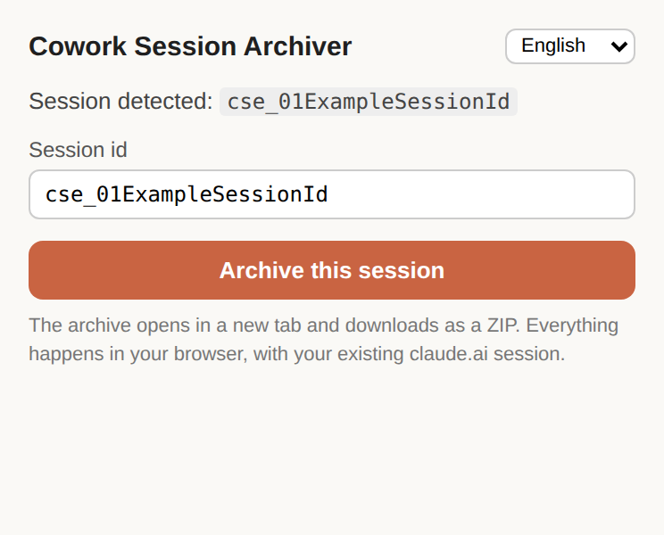
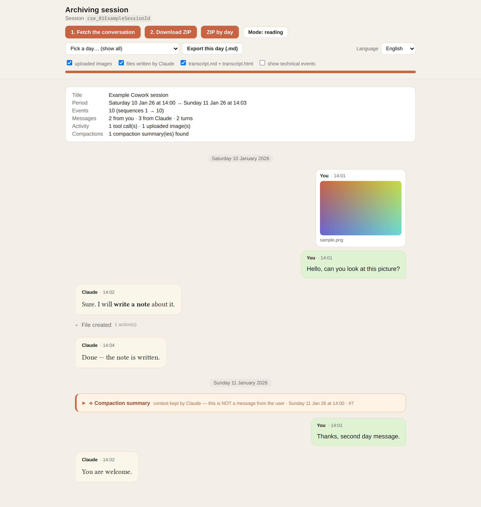
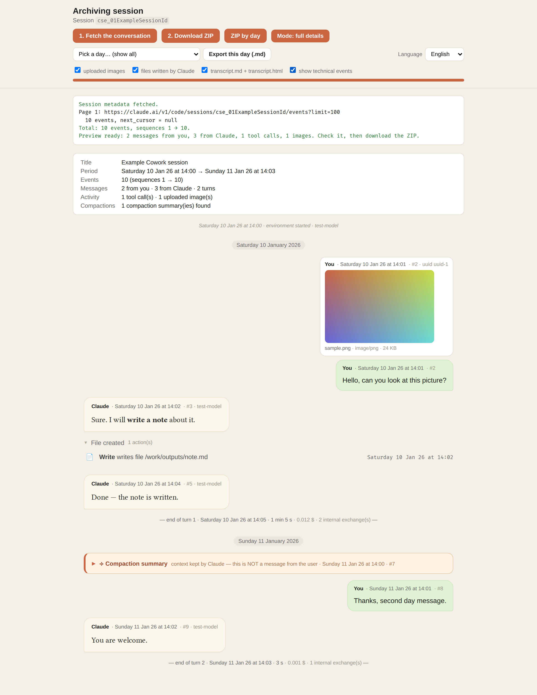

# Cowork Session Archiver

<!-- authors: 7hud41 · license: MIT -->

A Chrome extension that archives a **claude.ai Cowork session** (the `claude.ai/cowork/cse_…` pages) as a complete, self-contained ZIP: the raw event log, the images you uploaded, every tool call and sub-agent trace, the files Claude wrote, the compaction summaries, and a readable transcript.

It exists because Cowork sessions are not conversations: the official export and the usual conversation exporters do not see them. The extension talks to the same endpoint the Cowork page uses, with your own browser session, and keeps **everything**, untouched. Formatting is a separate, later step, done from the raw dump.

Companion projects:

- [archive-cowork-conv-claude-desktop](https://github.com/7hUd41/archive-cowork-conv-claude-desktop) — the same engine for the **local** Cowork sessions stored by the Claude desktop app, with projects and a session index.
- [archive-cowork-conv-claude-export-viewer](https://github.com/7hUd41/archive-cowork-conv-claude-export-viewer) — a lightweight page that reopens a ZIP produced by either tool.

## Screenshots

The popup detects the session from the active tab:



The archive page in **reading** mode — chat-style preview, day separators, compaction summary flagged as a distinct card:



The same session in **full details** mode with technical events shown — timestamps, sequence numbers, model, tool parameters and results, end-of-turn markers:



(All screenshots use the synthetic fixtures from `tests/`, not a real conversation.)

## What you get

```
cowork-cse_…-<timestamp>.zip
├── events.json          raw event log, untouched, sorted by sequence_num  ← source of truth
├── session.json         session metadata (title, dates) when the API provides it
├── manifest.json        what was captured: pages fetched, counts, missing sequences, time zone, notes
├── images/              every image you uploaded (named by sequence number + original name)
├── written-files/       files Claude wrote with its Write tool, rebuilt from the log
├── transcript.md        readable transcript (you / Claude / tools / compaction summaries)
└── transcript.html      the same preview as in the extension, standalone (fonts and images embedded)
```

The **ZIP by day** button produces one folder per day instead (`days/<YYYY-MM-DD>/<day>.md` + that day's images and written files), plus `index.md` and the raw `events.json`. The **Export this day (.md)** button exports a single day as Markdown, full text, meant to be fed back to Claude after a mid-day compaction.

Compaction summaries (the context Claude writes for itself when the conversation is compacted) are detected and shown as a distinct card, never as a message from you.

## Install

1. Download or clone this repository.
2. Open `chrome://extensions`, enable **Developer mode**, click **Load unpacked** and select the folder.
3. Open a Cowork session on claude.ai and click the extension icon.

The popup detects the session id from the tab URL (`cse_…` or `session_…`); you can also paste one. The archive page then opens in a new tab: **1. Fetch the conversation** (paginated, newest-first, with the cursor parameter detected automatically), check the preview, then **2. Download ZIP**.

## Preview modes

- **Reading** mode: chat-style layout, time only, activity blocks collapsed.
- **Full details** mode: full timestamps, sequence numbers, model, token counts, tool parameters and results, sub-agent activity.
- **Show technical events** reveals system events, environment logs and injected reminders.
- A **day filter** shows one day at a time; the language selector switches the interface (English by default, French available). Exports follow the selected language.

## How it works

The Cowork page loads its history from `GET https://claude.ai/v1/code/sessions/{id}/events?limit=100`, which requires the `anthropic-version` header and answers `{ data, next_cursor, resume_cursor }`, newest events first. The extension calls that endpoint with `credentials: include`, walks every page, deduplicates by event id, sorts by `sequence_num`, and reports any gap in the sequence in `manifest.json`.

Everything runs inside your browser. The extension has no server, no analytics, and never sends anything anywhere. Permissions: `activeTab`, `tabs` (to read the current tab URL) and host access to `claude.ai`.

## Known limits

- **Since 2026-10-06 claude.ai opens Cowork sessions under `claude.ai/chat/<uuid>`**; the popup only recognises the former `claude.ai/cowork/cse_…` form, so detection from the tab URL fails on the new pages. Paste the `cse_…` session id manually for now — see `TODO.md`.
- Reasoning ("thinking") blocks are empty server-side; they cannot be archived.
- Non-image uploads are referenced by name and uuid only: their content is not in the events API.
- Timestamps are UTC instants; the original time zone is not recorded. The preview and exports use the browser time zone unless a host page sets `window.DISPLAY_TZ`.
- Only Chromium-based browsers (Manifest V3).

## Development

Plain JavaScript, no build step, no dependencies beyond the vendored `jszip.min.js`. Files:

- `popup.html` / `popup.js` — session id detection.
- `archive.html` / `archive.js` — fetching, extraction, preview, exports. This is the engine reused by the companion projects.
- `viewer.css` / `viewer.js` — preview styles and behaviours, also embedded in `transcript.html`.
- `i18n.js` — English source strings, French dictionary, language persistence.
- `fonts/` — Libertinus Serif and Fira Code (OFL).

Tests are end-to-end (Playwright, headless Chromium) with synthetic fixtures: see `tests/README.md`.

## License

MIT — see `LICENSE`. Fonts under the SIL Open Font License, JSZip under MIT.
